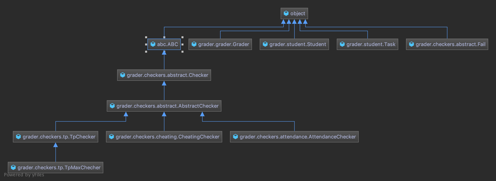

# Implementation of auto-grader tool using Chain of Responsibility design pattern

## Environment
Recommend you to run in docker container (You need pre-installed docker client).

All python dependencies in ``requirements.txt``.

### Build docker
```console
docker build -t grader .
```

### Test automatically (by pytest)

```console¬
docker run grader:latest
```

### Test by hands
```console
docker run -it --rm --entrypoint /bin/bash grader:latest
python grade.py --students tests/templates/students.yml --grader tests/templates/avg_tp_grader.yml
python grade.py --students tests/templates/students.yml --grader tests/templates/max_tp_grader.yml
python grade.py --students tests/templates/students.yml --grader tests/templates/cheating_grader.yml
```

### Class Diagram
Grader class diagram 